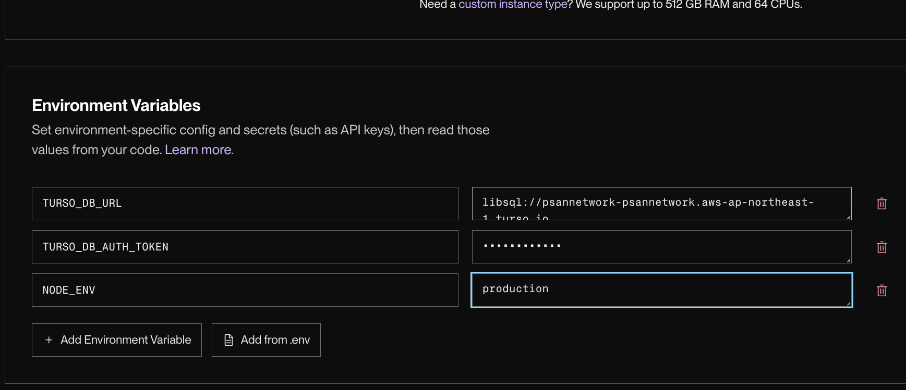

# ☁️ Render.com で世界中に公開する

[Render.com](https://render.com/) を使って、ブログをインターネット上に公開する方法を詳しく説明します。

---

## ⚠️ 初めに知っておくべき Render の仕様

Render の「Free Plan (無料プラン)」には以下の特徴があります。これを知っておくと、運用がスムーズになります。

1.  **スリープ機能**: しばらくアクセスがないと、サーバーが自動的に「お休み」に入ります。その次に誰かがアクセスした際、**起動に 30秒〜1分ほど** かかることがありますが、故障ではありません。
2.  **ファイルが消える (一時ストレージ)**: 無料プランのサーバーは、新しくデプロイ（更新）した際や再起動した際に、**保存した画像などのファイルがすべてリセット**されます。
    - **解決策**: このブログの「設定」で、保存先を **「SQLite Database」** に設定することで、この問題を回避できます。
3.  **無料の Disk はない**: 通常の SQLite ファイルを永続化するための「Disk」は有料（月$7〜）です。
    - **解決策**: 外部の無料DBサービス **「Turso」** を使うことで、完全無料でデータを守れます。

---

## 🚀 デプロイのステップ

### 1. GitHub にコードを送る

自分の GitHub リポジトリに、このプロジェクトのコードを `git push` してください。

### 2. Render で Web Service を作成

1.  Render ダッシュボードで **[New +]** → **[Web Service]** をクリック。
2.  自分のリポジトリを選択して **[Connect]**。

### 3. 設定項目を入力

- **Name**: `my-awesome-blog` (あなたの好きな名前)
- **Region**: `Singapore` (日本から一番近く、高速です)
- **Runtime**: `Docker` (自動で判定されます)
- **Instance Type**: `Free` (無料)

### 4. 環境変数の設定 (最重要)

**[Advanced]** ボタンを押し、**[Add Environment Variable]** をクリックして以下の 3つを登録します。

| キー                  | 値の例                      | 説明                       |
| :-------------------- | :-------------------------- | :------------------------- |
| `TURSO_DB_URL`        | `libsql://your-db.turso.io` | Turso で作成した DB の URL |
| `TURSO_DB_AUTH_TOKEN` | `eyJhbGci...`               | Turso の認証トークン       |
| `NODE_ENV`            | `production`                | 本番環境であることを指定   |

### 5. 公開開始

**[Create Web Service]** をクリック！
あとは Render が自動的にビルド（プログラムの組み立て）を行い、数分後に緑色の「Live」という文字が出れば成功です。

---

## 🛠️ 公開した後の必須作業

公開された URL にアクセスし、管理画面にログインして以下の設定を行ってください。

1.  **[設定 (Settings)]** メニューを開く。
2.  **[Storage Strategy]** セクションを探す。
3.  **[File Storage Method]** を **`SQLite Database`** に変更して保存。

**※ これを忘れると、アップロードした画像がサーバーの再起動時に消えてしまいます！**

---

### ⏭️ 次のステップ
- **[データベース(Turso)の詳しい設定方法](./Database-Turso.md)**
- **[さっそく記事を書いてみる](./User-Manual.md)**
